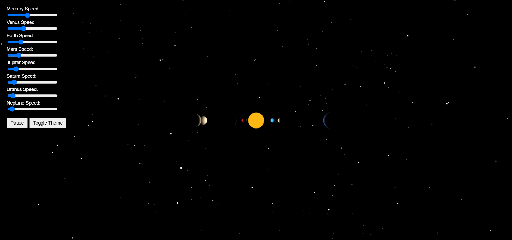

# 🌌 3D Solar System Simulation using Three.js

This project is an interactive 3D simulation of the Solar System, built using the [Three.js](https://threejs.org/) WebGL library. It visually represents the orbits and rotations of the planets around the Sun, enhanced with user controls and modern UI features.

---

## 🚀 Features

- ☀️ Realistic 3D models for planets and the sun  
- 🌍 Adjustable orbital speeds via sliders  
- 🌟 Starfield background to simulate space  
- 🛑 Pause/▶️ Resume animation button  
- 🪐 Tooltips showing planet names on hover  
- 🌗 Light/Dark mode toggle  
- 🔍 Click on any planet to zoom/focus on it  

---

## 📂 Folder Structure

```
.
├── index.html         # Main simulation file
├── README.md          # You're here!
```

---

## 💻 How to Run the Simulation

### 🔧 Option 1: Run Locally in a Browser

> ⚠️ No server setup required! This is a 100% static HTML+JS project.

1. Download or clone this repository:
   ```bash
   git clone https://github.com/your-username/solar-system-sim.git
   ```

2. Navigate into the project directory:
   ```bash
   cd solar-system-sim
   ```

3. Open `index.html` in your preferred web browser:
   - Double-click `index.html`
   - Or open it using VS Code Live Server extension

---

### 🌐 Option 2: Run via GitHub Pages

You can deploy this project instantly with GitHub Pages:

1. Push your code to a GitHub repository
2. Go to **Settings > Pages**
3. Choose the `main` branch and root directory
4. Access the simulation at `https://your-username.github.io/repo-name/`

---

## 🧪 Usage Instructions

- 🎚 Use the sliders in the control panel to adjust planet speeds.
- 🔁 Click **Pause/Resume** to stop/start animation.
- 🌑 Click **Toggle Theme** to switch between Dark/Light modes.
- 🖱️ Hover over a planet to see its name.
- 🖱️ Click on a planet to zoom in and center it in view.

---

## 📸 Preview



---

## 📦 Dependencies

- [Three.js](https://cdnjs.com/libraries/three.js) (loaded via CDN):
  ```html
  <script src="https://cdn.jsdelivr.net/npm/three@0.148.0/build/three.min.js"></script>
  ```

---

## 🙌 Acknowledgments

- Inspired by NASA's planetary data
- Built using [Three.js](https://threejs.org/)
- Developed as part of a web graphics learning project

---

## 📄 License

MIT License – free to use, share, and modify.
